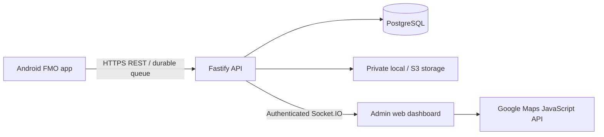

# Architecture and data rules

## Target topology

Phase 1 implements the foundation and Phase 2 the REST API/private storage. Phase 3 supplies Android source with native verification pending. Phase 4 supplies the React laptop dashboard, Google Maps integration and authenticated Socket.IO stream. All runtime data goes through authorized backend routes; clients never connect directly to PostgreSQL or a public image bucket. This is one organization: ADMIN and SUPER_ADMIN access its FMOs. Multi-organization tenancy requires organization keys and scoped authorization before use.

## Phase 4 real-time flow

`GET /api/tracking/snapshot` pages active FMO accounts through indexed lateral queries for latest duty, attendance and location, avoiding a per-marker HTTP request. HTTP responses from successful duty mutations trigger coalesced post-commit publication. The server rechecks admin account/session authorization before each socket batch. Only configured origins and admin roles can connect; clients cannot publish or join arbitrary rooms. Reconnect reauthenticates and fetches the snapshot; a 30-second browser refresh recovers missed events. An outage does not remove last-known positions.

Socket.IO publication/rate limits are process-local. Multi-instance immediate fanout requires a shared broker/adapter or transactional event outbox in release hardening; a successful API commit does not depend on socket delivery. Browser access tokens stay in memory, refresh credentials in HttpOnly cookies, and Web Locks serialize rotations across tabs. Private selfie blob URLs are revoked on dialog close. See [dashboard operations](../admin-dashboard/README.md).

The admin uses a laptop browser, not a tracking phone. FMO Android phones and the laptop connect to the same reachable HTTPS backend. Closing the dashboard browser must not stop field data collection or storage. A development backend may run locally on a laptop, but field use requires that backend to remain running and reachable from the phones; a laptop-only localhost address is insufficient outside its local network.

## Repository boundaries

- `backend/src`: API runtime, authentication, duty/admin/record routes, transactional services, environment parsing, security and private storage.
- `database/migrations`: append-only schema evolution, reviewed SQL constraints/indexes.
- `database/seed`: opt-in development data; no automatic startup seeding.
- `packages/contracts`: shared validation/types/status derivation, usable by API and clients.
- `mobile`: Android client, Phase 3.
- `admin-dashboard`: browser operations client, Phase 4.

## Relational model

`users` owns credentials, role, activation and a token-revocation version. `fmos` extends FMO-role users. Admin accounts use the same authentication table rather than a second credential store. `devices` stores an installation identifier and minimal diagnostic fields, not advertising IDs/IMEI.

`duty_sessions` snapshots configured duration and interval, records server start/expected/actual end, and carries idempotency IDs. A partial unique index allows at most one ACTIVE session per FMO. Completion is irreversible through ordinary updates. `attendance` references a unique owned session and stores a private image key/hash, observation coordinates/accuracy, and verification metadata. A locked parent-session check prevents attendance after completion. No attendance row is created by duty start.

`location_logs` stores point IDs, accuracy, optional speed/battery, observation and receipt timestamps, and mock/demo flags. Composite foreign keys prevent cross-FMO device/session associations. `(duty_session_id, client_point_id)` is the duplicate-retry key. Append-only guards protect GPS/audit history; foreign keys restrict cascading deletion. Database owners can bypass guards, so production runtime grants and backup/retention procedures still matter.

`auth_sessions` owns login-session expiry and revocation. `refresh_tokens` stores only SHA-256 digests, expiry and revocation timestamps, linked to a session. Refresh-token reuse revokes that session. `camera_challenges` stores only challenge-token digests. `audit_logs` captures important admin changes in the same transaction as the change. It must not contain passwords, raw tokens or image bytes. Migration 002 adds these features without modifying migration 001.

Attendance reset preserves the original row as superseded evidence and allows a new current attendance through a partial unique index. Database triggers prevent edits to original attendance fields. Admin resets are allowed only while the duty is active and require an audited reason.

## Status and time

Lifecycle status and telemetry freshness are different dimensions:

| Dimension | Logic |
| --- | --- |
| NOT_STARTED | No duty in the selected reporting period |
| ON_DUTY | Active session without attendance |
| CHECKED_IN | Active session with attendance |
| COMPLETED | Session has actual end time |
| TRACKING | Active session with a sufficiently recent validated observation |
| NO_RECENT_LOCATION | Observation age >= stale threshold |
| OFFLINE | Observation absent or age >= offline threshold |

“Offline” means **no recent location**, not proof that the phone has no internet. New uploads do not automatically imply fresh GPS: use `recorded_at`, not `received_at`, for location age. Last known position is the maximum valid observation time, not the last row inserted. Keep both timestamps for diagnostics. Last seen exists as a derived location timestamp and device heartbeat timestamp; a never-seen FMO returns null, not an invented time.

Use UTC `timestamptz` in storage. Render organization dates in configured IANA timezone (default Asia/Karachi). Daily queries use timezone-aware start-inclusive/end-exclusive bounds. Sessions spanning midnight retain their full route. Duty duration is actual end minus start; for active sessions, display elapsed and expected end separately. Completion need not depend on check-in—an officer may finish a duty with missing attendance, which reports must show honestly.

Server generates duty and attendance timestamps. Offline GPS needs the device observation timestamp; the database permits a bounded two-minute clock discrepancy around start/future receipt. Phase 2 validates ownership, time windows and immutable point IDs before persistence. It stores raw device time separately and bounds slightly future observations to server receipt time. New points cannot exceed the collection cutoff after completion. Finalization rejects conflicting stop times explicitly rather than quietly losing points.

## GPS quality and queue behavior

Store every valid GPS point with accuracy. Poor accuracy and mock-location flags must remain visible; do not silently turn unreliable points into trusted attendance or discard all evidence of gaps. The API enforces the configurable threshold on check-in, retains poor tracking observations with quality information, and provides a separate last-reliable observation. The map should distinguish poor-quality last observations from good ones.

Mobile must persist points in SQLite before HTTP upload. Use bounded batches (at most 200), exponential backoff, a single upload worker and durable retry IDs. Upload acknowledgment is per point. Final location and an end intent must also survive restart. Android collection stops immediately on user End Duty; offline server finalization and queued uploads can continue without starting location again. Phase 2 stores an optional unverified `reported_stop_time` separately from authoritative server end, exposes both duration interpretations, and rejects points beyond that collection cutoff. Missing final GPS must be explicitly recorded as a failure reason; no point is invented.

## Security and storage boundaries

Password hashing uses scrypt (N=131072, r=8, p=1, random 16-byte salt, 64-byte output), with bounded concurrent hashing to limit memory. No password is stored or logged in plaintext. Phase 2 implements authentication, token rotation/replay detection, IP/account login rate limits, role/ownership checks and immediate revocation. Mobile refresh tokens belong in secure storage; browser refresh tokens use HttpOnly, same-site cookies. See [API contracts](API.md).

Private storage keys are relative opaque references, not public URLs. Serving a selfie requires authorized access and verifies its stored hash. Uploaded images undergo signature/size/dimension validation, full decode and metadata-stripping re-encoding. Local resolution is restricted to the private root; S3 uses signed private object operations. A future Android camera-only UI plus the implemented short-lived server challenge reduces basic replay, but a compromised client can still submit images; this is not biometric proof. Provider-backed liveness must be separately enabled and labeled.

Runtime containers run as a nonroot user. Compose is a local development profile; production requires TLS termination, trusted proxy rules, restricted database/storage networking, distinct migration credentials, secrets management, backup monitoring and tested restore. In-memory rate limits and a single Socket.IO process must be replaced or coordinated for horizontal scaling in Phase 6.
